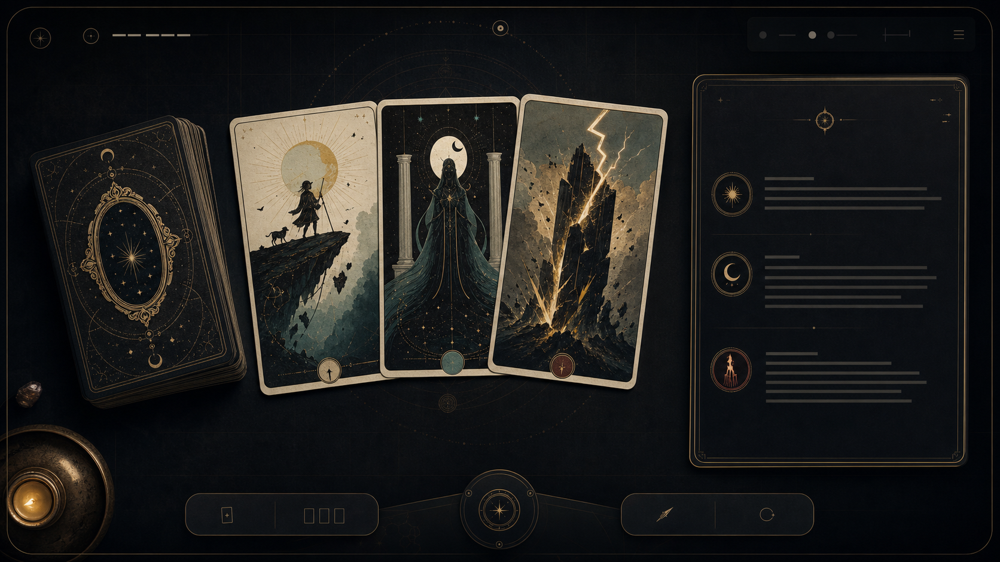

# 下一阶段方向

更新时间：2026-06-30

这份文档记录当前判断：Arcana Mirror 之后会迁到个人网站，但现在优先把公网版本尽快做得可用、好看、能直接 AI 解牌。所有价格与平台限制都会变化，实施前需要再复核官网。

## 当前结论

- 前端继续先放在 GitHub Pages，保持最快可访问。
- AI 解读用一个很薄的后端代理，不把模型 key 放进浏览器。
- 后端首选 Cloudflare Worker；Vercel 适合以后整站迁移时顺手承载 API。
- 不做登录，不做用户系统，不做后台记录页面。
- 每个 IP 每天默认限制 20 次 AI 解读。
- UI 不强调“公网 AI”“隐私说明”“后台记录”等开发者视角内容；用户自然知道 AI 解读需要发送问题和牌面。
- 牌面初读继续保留，AI 是更深一层，不是唯一价值。

## 平台与成本判断

截至 2026-06-30：

- Cloudflare Workers 免费层包含 100,000 次 Worker 请求/天，Workers Paid 计划最低 5 USD/月并包含更高月度额度。这个项目的 20 次/IP/天限制远低于免费层，真正需要控制的是模型费用和滥用。
- Vercel Hobby 适合快速托管完整 Web 项目；官方 limits 文档显示 Hobby 有 1 million function invocations、4 CPU-hours、100 GB fast data transfer 等用量摘要。Vercel 更适合以后把整个个人网站迁过去，而不是只为了一个 DeepSeek 代理新开一套迁移。
- DeepSeek 当前价格按每 1M token 计费。`deepseek-v4-flash` 对低流量解读非常便宜，适合作为第一版 AI 供应商；预算风险主要来自无限公开调用，而不是正常使用。
- GPT Image / OpenAI 图像生成属于一次性制作成本，不会随用户抽牌持续消耗。更大的成本是多轮挑图、统一风格和返工时间。

因此当前最实用路径是：

```text
GitHub Pages frontend
  -> Cloudflare Worker /api/tarot/analyze 或 /api/tarot/analyze/stream
  -> DeepSeek API
  -> KV or D1 daily IP counter
```

以后迁到个人网站时，只需要把前端入口和 API endpoint 换到新域名；核心组件和数据结构继续复用。

## 后端形态

Cloudflare Worker 只做四件事：

1. 接收问题、牌阵、牌面、朝向、牌面初读和语言。
2. 根据 IP 做每日计数，默认超过 20 次返回温和的限流响应。
3. 用环境变量里的 `DEEPSEEK_API_KEY` 请求 DeepSeek。
4. 返回结构化 AI 解读；前端优先使用 SSE 流式输出。

MVP 不需要：

- 登录
- 用户资料
- 付费
- 管理后台
- 长期保存用户问题
- 在 UI 中铺开隐私说明

如果以后想看一点运行状况，只保留聚合计数即可，例如每日请求数、失败数、模型费用估算。不要为了“后台感”牺牲产品轻量感。

## 牌面策略

最好的方向不是直接找一套现成牌面，也不是一次性生成 78 张完整牌。

推荐做一套原创的 Arcana Mirror Deck：

1. 先生成视觉方向图、牌背和 3 张大阿尔卡那样张。
2. 风格稳定后生成 22 张大阿尔卡那。
3. 小阿尔卡那先用统一的符号系统实现：四元素、数字、宫廷牌姿态、纸张纹理、套色规则。
4. 等大阿尔卡那质量稳定，再决定是否把 56 张小阿尔卡那也做成完整插画。

不要直接使用现代商业塔罗牌图，也不要复制 Rider-Waite-Smith 构图。可以参考传统符号，但要让牌面有自己的视觉身份。

本轮方向参考图：



这张图适合作为气质参考：实体牌堆、镜面牌背、暗色桌面、金线边框、右侧解读面板。正式实现时要减少无关装饰，保证牌面、抽牌动作和解读内容是主角。

## 动效方向

动效应该比现在更有存在感，但服务于“抽牌真的发生了”。

- 牌堆有厚度和纸张边缘。
- 洗牌时牌背轻微错位、旋转、回弹。
- 选牌前可以有一段扇形展开或半扇展开。
- 发牌时从牌堆飞到牌位，落位有轻微惯性。
- 翻牌时展示牌背到牌面的真实翻转，而不是简单淡入。
- 结果区让牌面一直留在视野里，解读从旁边或下方自然出现。
- 尊重 `prefers-reduced-motion`，但默认效果可以更华丽。

不要做廉价的强光、过度粒子、赌场感闪烁。好的华丽感来自材质、节奏、层次和可触摸感。

## UI 话术

面向用户的语言要自然，不要出现开发者自述式表达。

避免：

- 克制现代化
- 面向练习表的产品说明
- 后端记录
- 公网 AI 提示
- 隐私声明墙

可以使用：

- 抽牌
- 生成 AI 解读
- 重新抽
- 保存这次解读
- 今天的牌面
- 先看牌意

用户来这里不是为了读产品定位，而是为了问一个问题、抽牌、得到一段有帮助的解释。

## 实施顺序

1. 视觉与动效：牌背、实体牌堆、发牌/翻牌动画、结果布局。
2. AI Worker：DeepSeek 代理、IP 每日 20 次、失败 fallback。
3. 牌面资产：牌背 + 3 张样张 + 22 张大阿尔卡那。
4. 小阿尔卡那符号系统：先统一设计语言，再决定是否全量插画。
5. 个人网站迁移：把工具作为 `myshkin451.com` 的一个可用页面，而不是营销落地页。
